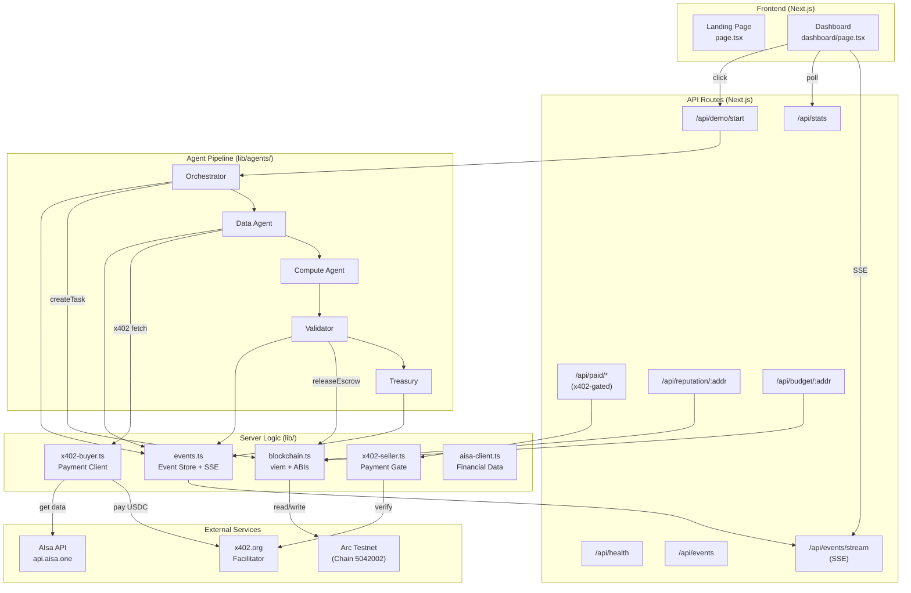
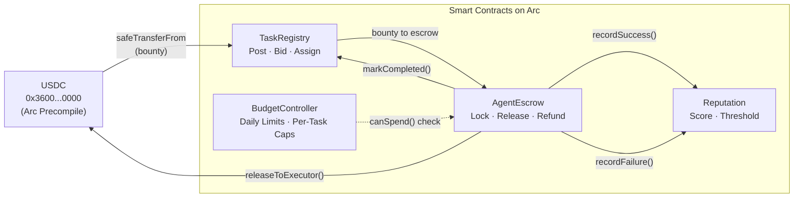
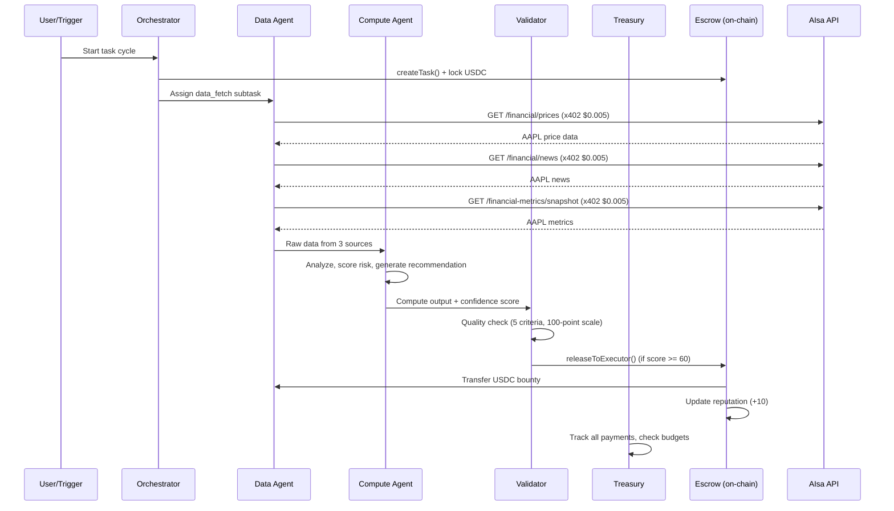

# PayQuorum

**The trustless agent labor market — built on Arc with Circle Nanopayments.**

Autonomous agents post tasks, bid on work, execute computations, validate results, and pay each other. All settlement in USDC on Arc via x402 micropayments with on-chain escrow, reputation, and budget controls.

> **Agentic Economy on Arc Hackathon 2026** · Track 2: Agent-to-Agent Payment Loop

---

## Architecture



## Smart Contract Design



### Contracts

| Contract | Purpose | Key Functions |
|----------|---------|---------------|
| **TaskRegistry** | On-chain task marketplace | `createTask()`, `placeBid()`, `assignTask()`, `markCompleted()` |
| **AgentEscrow** | Trustless USDC escrow | `recordEscrow()`, `releaseToExecutor()`, `refundToPoster()` |
| **Reputation** | Agent scoring (+10 success, -15 failure) | `registerAgent()`, `recordSuccess()`, `getReputation()` |
| **BudgetController** | Spending limits enforcement | `configureBudget()`, `canSpend()`, `recordSpending()` |

### Deployed & Verified Contracts (Arc Testnet)

All 4 contracts are deployed, verified, and source code is publicly readable on ArcScan:

| Contract | Address | Verified Source |
|----------|---------|-----------------|
| **TaskRegistry** | `0x2Ec3180e23AC9C82205cb3Cd6885f2a27543E291` | [View Code](https://testnet.arcscan.app/address/0x2Ec3180e23AC9C82205cb3Cd6885f2a27543E291#code) |
| **AgentEscrow** | `0xC79BE48Cf33bA378fD6826cBAEbBaC6f0D05c389` | [View Code](https://testnet.arcscan.app/address/0xC79BE48Cf33bA378fD6826cBAEbBaC6f0D05c389#code) |
| **Reputation** | `0xfB225D66f7627F2e0a39A8F0D927253F6fF8A9CB` | [View Code](https://testnet.arcscan.app/address/0xfB225D66f7627F2e0a39A8F0D927253F6fF8A9CB#code) |
| **BudgetController** | `0x571eC845335B89985Be599dD6Bd40b77B072C455` | [View Code](https://testnet.arcscan.app/address/0x571eC845335B89985Be599dD6Bd40b77B072C455#code) |

### Network Configuration

| Resource | Value |
|----------|-------|
| Chain ID | `5042002` |
| USDC (ERC-20 precompile) | `0x3600000000000000000000000000000000000000` |
| RPC | `https://rpc.testnet.arc.network` |
| Explorer | `https://testnet.arcscan.app` |
| Faucet | `https://faucet.circle.com` |
| x402 Facilitator | `https://x402.org/facilitator` |
| ERC-8004 Agent Catalog | `/.well-known/agent-catalog.json` |

## Agent Pipeline



## Quick Start

```bash
# 1. Clone and install
git clone https://github.com/vjuliaife/PayQuorum
cd PayQuorum
npm install

# 2. Start development server
npm run dev
# Open http://localhost:3000

# 3. Run the agent demo
# Click "Run Demo" on the dashboard, or:
curl -X POST http://localhost:3000/api/demo/start -H "Content-Type: application/json" -d '{"cycles": 10}'

# 4. Watch live events
# Dashboard at http://localhost:3000/dashboard shows real-time SSE feed
```

### Deploy Contracts (Optional — for on-chain transactions)

```bash
# Install Hardhat dependencies
cd contracts && npm install

# Fund deployer wallet
# Visit https://faucet.circle.com → select Arc Testnet → paste address

# Deploy
cp ../.env.example .env  # Fill in DEPLOYER_PRIVATE_KEY
npx hardhat compile
npx hardhat run scripts/deploy.ts --network arcTestnet

# Copy output addresses to root .env.local
```

## Tech Stack

| Layer | Technology | Version |
|-------|-----------|---------|
| Framework | Next.js (App Router) | 16.2.4 |
| Blockchain | Arc Testnet | Chain 5042002 |
| Smart Contracts | Solidity + Hardhat | 0.8.24 / 2.28.6 |
| Contract Libs | OpenZeppelin | 5.6.1 |
| EVM Client | viem | 2.48.1 |
| x402 Protocol | @x402/core, @x402/evm, @x402/fetch | 2.10.0 |
| Nanopayments | @circle-fin/x402-batching | 2.1.0 |
| AI Analysis | Google Gemini (@google/genai) | gemini-2.5-flash |
| AI Summarization | Featherless AI (openai SDK) | LLaMA 3.1 8B |
| Financial Data | AIsa API | api.aisa.one |
| Standards | ERC-8004 Agent Registration | v1 |
| Styling | Tailwind CSS | 4.x |
| Fonts | Geist Sans + Geist Mono | — |

## Environment Variables

| Variable | Description | Required |
|----------|-------------|----------|
| `ARC_TESTNET_RPC` | Arc RPC endpoint | No (defaults to public) |
| `USDC_ADDRESS` | USDC on Arc | No (defaults to 0x3600...) |
| `DEPLOYER_PRIVATE_KEY` | For contract deployment | For deploy only |
| `ORCHESTRATOR_PRIVATE_KEY` | Orchestrator agent wallet | For on-chain txs |
| `DATA_AGENT_PRIVATE_KEY` | Data agent wallet | For on-chain txs |
| `COMPUTE_AGENT_PRIVATE_KEY` | Compute agent wallet | For on-chain txs |
| `VALIDATOR_PRIVATE_KEY` | Validator agent wallet | For on-chain txs |
| `TREASURY_PRIVATE_KEY` | Treasury agent wallet | For on-chain txs |
| `TASK_REGISTRY_ADDRESS` | Deployed TaskRegistry | For on-chain txs |
| `AGENT_ESCROW_ADDRESS` | Deployed AgentEscrow | For on-chain txs |
| `REPUTATION_ADDRESS` | Deployed Reputation | For on-chain txs |
| `BUDGET_CONTROLLER_ADDRESS` | Deployed BudgetController | For on-chain txs |
| `AISA_API_KEY` | AIsa API bearer token | For real financial data |
| `GEMINI_API_KEY` | Google Gemini API key (free from aistudio.google.com) | For AI analysis |
| `FEATHERLESS_API_KEY` | Featherless AI key (featherless.ai) | For LLM summarization |
| `X402_FACILITATOR_URL` | x402 payment facilitator | No (defaults to x402.org) |

## Margin Analysis

Why Circle Nanopayments on Arc are required:

| Network | Gas per Tx | 64 On-Chain Txs (8 cycles) | Verdict |
|---------|-----------|---------------------------|---------|
| Ethereum L1 | $0.50 | $32.00 | Revenue: $0.32. Gas is 10,000% of revenue. |
| Arbitrum | $0.05 | $3.20 | Still 10x the total revenue. |
| Base | $0.02 | $1.28 | 4x the revenue. Margin destroyed. |
| Arc (direct) | ~$0.01 | $0.64 | 2x revenue. Tight but possible. |
| **Arc + Nanopayments** | **~$0.00** | **~$0.00** | **Margin fully preserved via batched settlement.** |

Revenue per action: $0.005 USDC. Each demo cycle generates 8 real on-chain transactions across all 4 contracts.
Arc's gas (~$0.01/tx) is 50x cheaper than Ethereum, and Circle Nanopayments batches settlement to eliminate per-tx gas entirely for high-frequency flows.

## Project Structure

```
payquorum/
├── app/
│   ├── page.tsx                    # Landing page
│   ├── dashboard/page.tsx          # Live dashboard
│   ├── layout.tsx                  # Root layout (Geist fonts, dark theme)
│   ├── globals.css                 # Tailwind + custom styles
│   └── api/
│       ├── health/route.ts         # Server status
│       ├── events/route.ts         # Full event log
│       ├── events/stream/route.ts  # SSE real-time stream
│       ├── stats/route.ts          # Event breakdown
│       ├── demo/start/route.ts     # Start N task cycles
│       ├── demo/cycle/route.ts     # Run single cycle
│       ├── reputation/[address]/   # On-chain reputation read
│       ├── budget/[address]/       # On-chain budget read
│       └── paid/                   # x402-gated data endpoints
│
├── lib/
│   ├── config.ts                   # Arc chain config, verified addresses
│   ├── blockchain.ts               # viem clients + real ABIs
│   ├── events.ts                   # Event store + SSE broadcaster
│   ├── x402-seller.ts              # Payment verification
│   ├── x402-buyer.ts               # Payment client
│   ├── aisa-client.ts              # Real AIsa API endpoints
│   ├── abi/                        # Extracted from Hardhat artifacts
│   └── agents/
│       ├── pipeline.ts             # Full task cycle orchestration
│       ├── orchestrator.ts         # Task decomposition + on-chain creation
│       ├── data-agent.ts           # AIsa data fetching via x402
│       ├── compute-agent.ts        # Gemini 2.5 Flash analysis
│       ├── validator-agent.ts      # Quality checks + escrow release
│       └── treasury-agent.ts       # Budget enforcement + audit
│
├── contracts/                      # Standalone Hardhat 2.28.6 project
│   ├── contracts/                  # 4 Solidity contracts (verified on ArcScan)
│   ├── scripts/
│   │   ├── deploy.ts               # Deploy to Arc Testnet
│   │   └── verify-contracts.ts     # Verify source code on ArcScan
│   └── hardhat.config.ts
│
├── scripts/                        # Setup & operations
│   ├── generate-wallets.ts         # Generate 6 EOA wallets
│   ├── fund-agents.ts              # Distribute USDC from deployer
│   ├── check-balances.ts           # Verify all wallet balances
│   ├── configure-budgets.ts        # Set agent budget limits on-chain
│   ├── register-agents.ts          # Register agents in Reputation
│   └── set-validator.ts            # Set validator in AgentEscrow
│
├── public/.well-known/             # ERC-8004 agent registration
│   ├── agent-catalog.json          # Agent discovery catalog
│   └── agents/*.json               # Per-agent registration files
│
├── .env.example
├── SETUP.md                        # Step-by-step setup guide
└── README.md
```

## Deployment

### Vercel (Frontend + API)

```bash
# The entire Next.js app deploys as one unit
vercel deploy
# Set environment variables in Vercel dashboard
```

### Contracts (Arc Testnet)

```bash
cd contracts
npx hardhat run scripts/deploy.ts --network arcTestnet
```

---

Built for the [Agentic Economy on Arc Hackathon 2026](https://lablab.ai/ai-hackathons/nano-payments-arc) · Track 2: Agent-to-Agent Payment Loop
